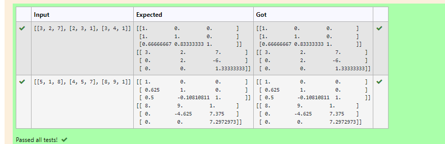

# LU Decomposition without zero on the diagonal

## AIM:
To write a program to find the LU Decomposition of a matrix.

## Equipments Required:
1. Hardware – PCs
2. Anaconda – Python 3.7 Installation / Moodle-Code Runner

## Algorithm
###1.To Find L and U matrices with LU Decomposition

1. Get the matrix from the user.

2. Using "from scipy.linalg import lu"to import scipy (LU)module.
 
3. Using "L,U=lu(a)"we can get the matrix of L and U.
 
4. print the result matrices (L and U matrices).
 
5. End the program.

###2.To Find X matrix with LU Decomposition
1.Get the matrix from yhe user.

2.Using "from scipy.linalg import lu_factor,lu_solve"to import scipy module for factorization and solving X.

3.Using "lu,piv=lu_factor(a)"

4

5.End the progamme
## Program:
```
/*
Program to find the LU Decomposition of a matrix.
Developed by:V.Navya
RegisterNumber:21004872
*/
```

## Output:
###1.To Find L and U matrices with LU Decomposition


###2.To Find X matrix with LU Decomposition


## Result:
Thus the program to find the LU Decomposition of a matrix is written and verified using python programming.

